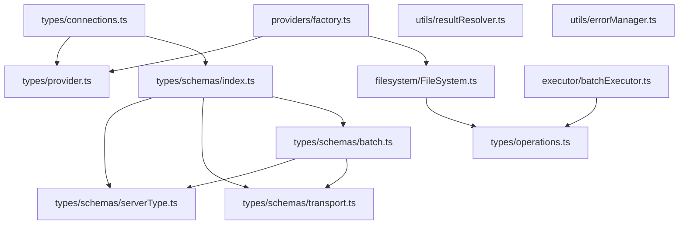
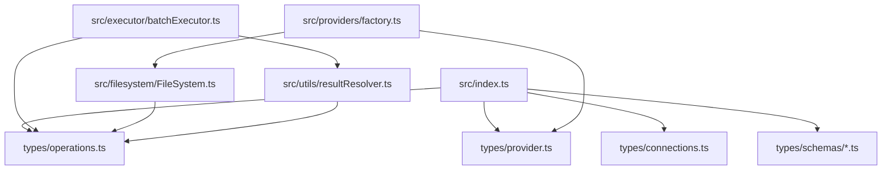
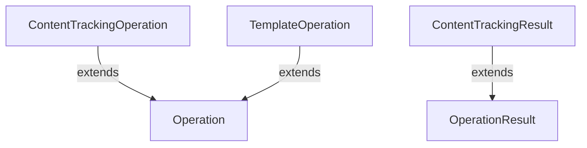
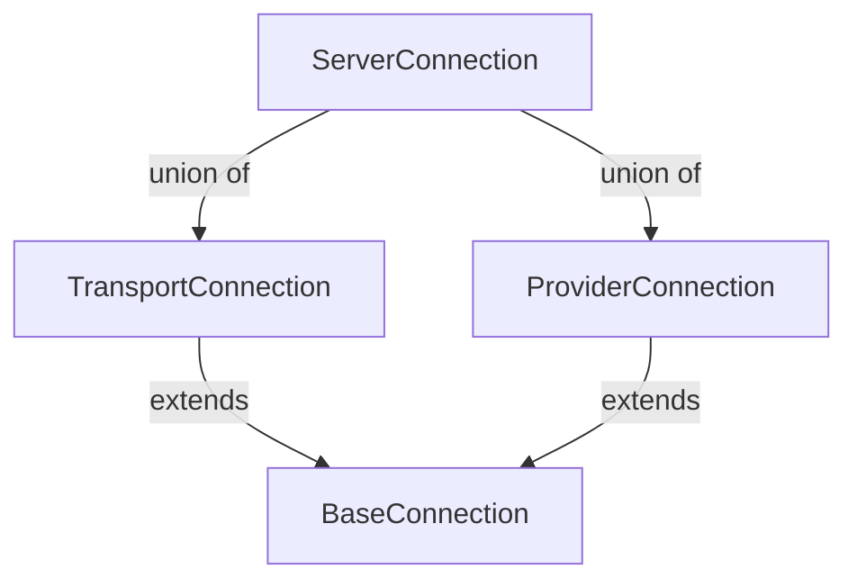
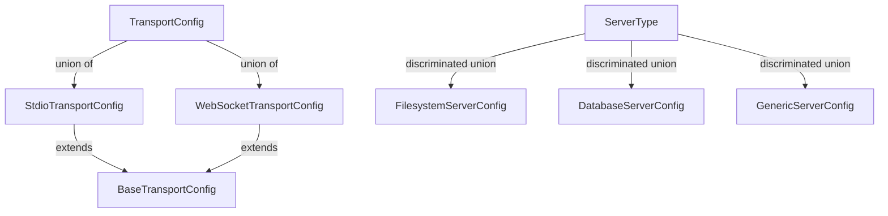
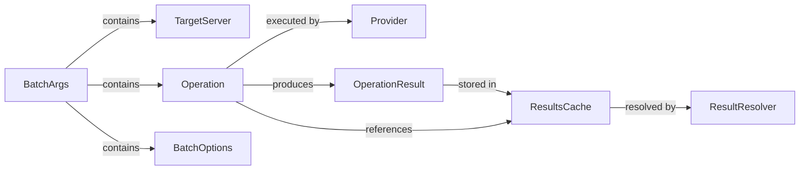
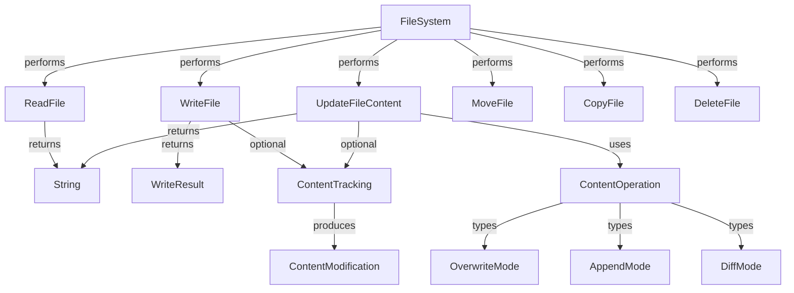

# BatchIt Type Relationship Map

This document maps the import/export relationships between type files in the BatchIt codebase, analyzes how types are imported and used across files, and identifies key type dependencies and hierarchies.

## Table of Contents

1. [Type File Structure](#type-file-structure)
2. [Import/Export Relationships](#importexport-relationships)
3. [Module Type Dependencies](#module-type-dependencies)
4. [Interface Extensions and Implementations](#interface-extensions-and-implementations)
5. [Key Type Visualizations](#key-type-visualizations)
6. [High-Impact Types](#high-impact-types)
7. [Recommendations](#recommendations)

## Type File Structure

The BatchIt codebase organizes its types across several files:

```
src/
├── types/
│   ├── operations.ts       # Core operation types
│   ├── provider.ts         # Provider-related types
│   ├── connections.ts      # Connection-related types
│   └── schemas/
│       ├── batch.ts        # Batch operation schemas
│       ├── index.ts        # Re-exports and common types
│       ├── serverType.ts   # Server type schemas
│       └── transport.ts    # Transport configuration schemas
├── filesystem/
│   └── FileSystem.ts       # Defines filesystem-specific types
├── utils/
│   ├── errorManager.ts     # Error handling types
│   └── resultResolver.ts   # Result resolution types
└── providers/
    └── factory.ts          # Provider factory types
```

## Import/Export Relationships

### Direct Type Imports/Exports



### Type Re-exports

The `schemas/index.ts` file serves as a central re-export point for schema-related types:

```typescript
// Re-export everything from individual schema modules
export * from "./serverType.js"
export * from "./transport.js"
export * from "./batch.js"

// Export common type combinations
import { ServerType } from "./serverType.js"
import { TransportConfig } from "./transport.js"
import { Operation, BatchOptions } from "./batch.js"

// Additional type definitions...
```

## Module Type Dependencies

This section maps which modules import which types, showing the dependency relationships.

### Core Module Dependencies



### Detailed Type Import Map

| Module | Imports Types From | Specific Types Imported |
|--------|-------------------|------------------------|
| `src/index.ts` | `types/schemas/index.js` | `BatchArgsSchema`, `ServerIdentity`, `TransportConfig`, `Operation`, `OperationResult`, `isHPCErrorResponse`, `HPCErrorResponse` |
| | `types/connections.js` | `ServerConnection`, `createTransportConnection`, `createProviderConnection`, `isTransportConnection`, `isProviderConnection` |
| `src/executor/batchExecutor.ts` | `types/operations.js` | `Operation`, `BatchExecutionOptions`, `OperationResult` |
| | `utils/resultResolver.js` | `resolveResultReferences` |
| `src/filesystem/FileSystem.ts` | `types/operations.js` | `ContentTrackingOptions` |
| `src/providers/factory.ts` | `types/provider.js` | `ProviderType` |
| | `filesystem/FileSystem.js` | `FileSystem`, `WriteOptions`, `ReadOptions`, `ContentOperation` |
| `src/utils/resultResolver.ts` | `resultsCache.js` | `resultsCache` |
| `src/utils/errorManager.ts` | `errorMapper.js` | `mapToMcpError` |

## Interface Extensions and Implementations

This section maps how interfaces extend or implement each other, showing the type hierarchy.

### Operation Type Hierarchy



### Connection Type Hierarchy



### Schema Type Hierarchy



### FileSystem Type Hierarchy

```mermaid
graph TD
    %% FileSystem types
    FileSystemOptions[FileSystemOptions]
    PathValidationConfig[PathValidationConfig]
    ReadOptions[ReadOptions]
    WriteOptions[WriteOptions]
    ContentOperation[ContentOperation]

    %% Content operation types
    OverwriteOperation[mode: "overwrite"]
    AppendOperation[mode: "append"]
    DiffOperation[mode: "diff"]

    %% Relationships
    FileSystemOptions -->|contains| PathValidationConfig
    ContentOperation -->|union of| OverwriteOperation
    ContentOperation -->|union of| AppendOperation
    ContentOperation -->|union of| DiffOperation
```

## Key Type Visualizations

### Batch Execution Flow Types



### File Operation Types



## High-Impact Types

These types are used across multiple modules and have the highest impact on the codebase:

### 1. Operation (src/types/operations.ts)

Used in:

- `src/index.ts`
- `src/executor/batchExecutor.ts`
- `src/types/schemas/batch.ts`
- `src/utils/resultResolver.ts`
- `src/utils/templateResolver.ts`

```typescript
export interface Operation {
  id?: string
  tool: string
  arguments?: Record<string, unknown> & {
    template?: string
    content?: unknown
  }
  dependsOn?: string | string[]
}
```

### 2. OperationResult (src/types/operations.ts)

Used in:

- `src/index.ts`
- `src/executor/batchExecutor.ts`
- `src/utils/responseFormat.ts`

```typescript
export interface OperationResult {
  id?: string
  tool: string
  success: boolean
  result?: unknown
  error?: string
  errorCode?: number
  durationMs?: number
}
```

### 3. ContentOperation (src/filesystem/FileSystem.ts)

Used in:

- `src/filesystem/FileSystem.ts`
- `src/providers/factory.ts`
- `src/filesystem/contentEditor.ts`

```typescript
export type ContentOperation =
  | {
      mode: "overwrite"
      content: string
      trackOptions?: ContentTrackingOptions
    }
  | { mode: "append"; content: string; trackOptions?: ContentTrackingOptions }
  | {
      mode: "diff"
      operations: LineDiffOperation[]
      trackOptions?: ContentTrackingOptions
    }
```

### 4. ServerIdentity (src/types/schemas/index.ts)

Used in:

- `src/index.ts`
- `src/types/connections.ts`
- `src/utils/transportValidation.ts`

```typescript
export interface ServerIdentity {
  name: string
  serverType: ServerType
  transport?: TransportConfig
  maxIdleTimeMs?: number
}
```

### 5. Provider (src/providers/factory.ts)

Used in:

- `src/index.ts`
- `src/types/connections.ts`
- `src/executor/batchExecutor.ts`

```typescript
export interface Provider {
  executeTool(name: string, args: unknown): Promise<unknown>
}
```

## Recommendations

Based on the analysis of type relationships and dependencies, here are recommendations for type system consolidation:

### 1. Consolidate Duplicate Types

Several types have similar structures but are defined in different files:

- `Operation` in `operations.ts` and `schemas/batch.ts`
- `OperationResult` in `operations.ts` and `schemas/batch.ts`
- `BatchExecutionOptions` in `operations.ts` and `BatchOptions` in `schemas/batch.ts`

Recommendation: Create a single source of truth for these types and use re-exports or type aliases for backward compatibility.

### 2. Standardize Type Hierarchies

Create clear type hierarchies with proper extension relationships:

```typescript
// Base operation type
export interface BaseOperation {
  id?: string
  tool: string
  dependsOn?: string | string[]
}

// Specialized operation types
export interface FileOperation extends BaseOperation {
  arguments: {
    path: string
    [key: string]: unknown
  }
}

export interface TemplateOperation extends BaseOperation {
  arguments: {
    template: string
    content?: unknown
    [key: string]: unknown
  }
}
```

### 3. Create Type Namespaces

Group related types into namespaces to improve organization:

```typescript
export namespace FileSystem {
  export interface Options { /* ... */ }
  export interface ReadOptions { /* ... */ }
  export interface WriteOptions { /* ... */ }
  export interface ContentOperation { /* ... */ }
}

export namespace Batch {
  export interface Operation { /* ... */ }
  export interface Result { /* ... */ }
  export interface Options { /* ... */ }
}
```

### 4. Implement Type Guards

Add type guards for discriminated unions to improve type safety:

```typescript
export function isOverwriteOperation(op: ContentOperation): op is OverwriteOperation {
  return op.mode === "overwrite";
}

export function isAppendOperation(op: ContentOperation): op is AppendOperation {
  return op.mode === "append";
}

export function isDiffOperation(op: ContentOperation): op is DiffOperation {
  return op.mode === "diff";
}
```

### 5. Centralize Type Re-exports

Create a central `types.ts` file that re-exports all types for easier imports:

```typescript
// src/types/index.ts
export * from "./operations.js";
export * from "./provider.js";
export * from "./connections.js";
export * from "./schemas/index.js";
```

This would allow modules to import all types from a single location:

```typescript
import { Operation, OperationResult, Provider } from "../types/index.js";
```

These recommendations align with the type system consolidation plan outlined in `docs/type-system-consolidation-plan.md` and will help create a more maintainable and consistent type system for the BatchIt codebase.
