# BatchIt Type System Analysis

This document provides a comprehensive analysis of the file and directory related types in the BatchIt codebase, identifying their properties, methods, usage patterns, inconsistencies, and relationships. This analysis will serve as the foundation for the Type System Consolidation phase of the refactoring plan.

## 1. File and Directory Related Types

### 1.1 Core Types

#### `FileSystem` (src/filesystem/FileSystem.ts)

The central class that provides unified filesystem operations with consistent error handling and validation.

**Properties:**

- `config: PathValidationConfig` - Configuration for path validation
- `maxConcurrent: number` - Maximum number of concurrent operations

**Methods:**

- `readFile(filePath: string, options?: ReadOptions): Promise<string>` - Read file content with enhanced type handling
- `readFiles(paths: string[], options?: ReadOptions): Promise<FileResult[]>` - Read multiple files concurrently
- `writeFile(filePath: string, content: unknown, options?: WriteOptions, previousResult?: unknown): Promise<WriteResult>` - Write content to file with optional templating and tracking
- `moveFile(sourcePath: string, destPath: string, options?: { overwrite?: boolean }): Promise<void>` - Move file from source to destination path
- `deleteFile(filePath: string): Promise<void>` - Delete file at specified path
- `copyFile(sourcePath: string, destPath: string): Promise<void>` - Copy file from source to destination path
- `updateFileContent(filePath: string, operation: ContentOperation, config: PathValidationConfig): Promise<string>` - Unified interface for different file content manipulation modes
- `copyRecursive(src: string, dest: string): Promise<void>` (private) - Recursively copies a file or directory

#### `PathValidationConfig` (src/filesystem/pathValidation.ts)

Configuration for path validation.

**Properties:**

- `rootDirectory: string` - Base directory for all operations
- `excludedDirs?: string[]` - Directories to exclude from operations

#### `FileSystemOptions` (src/filesystem/FileSystem.ts)

Options for creating a FileSystem instance.

**Properties:**

- `rootDirectory: string` - Base directory for all operations
- `excludedDirs?: string[]` - Directories to exclude from operations
- `maxConcurrent?: number` - Maximum number of concurrent operations

#### `ReadOptions` (src/filesystem/FileSystem.ts)

Options for file reading operations.

**Properties:**

- `encoding?: BufferEncoding` - File encoding
- `addLineNumbers?: boolean` - Whether to add line numbers to output
- `startLineNumber?: number` - Starting line number
- `checkBinary?: boolean` - Whether to check if file is binary
- `fileTypeHandling?: boolean` - Whether to handle specific file types (PDF, DOCX)

#### `WriteOptions` (src/filesystem/FileSystem.ts)

Options for file writing operations.

**Properties:**

- `tracking?: ContentTrackingOptions` - Options for tracking content changes
- `template?: string` - Template string for content generation

#### `FileResult` (src/filesystem/FileSystem.ts)

Result of a file operation.

**Properties:**

- `path: string` - Path of the file
- `content?: string` - Content of the file if operation was successful
- `error?: string` - Error message if operation failed

#### `WriteResult` (src/filesystem/FileSystem.ts)

Result of a file write operation.

**Properties:**

- `content: string` - Content that was written
- `summary?: string` - Summary of the operation

#### `ContentOperation` (src/filesystem/FileSystem.ts)

Represents different modes of file content manipulation.

**Union Type:**

- `{ mode: "overwrite"; content: string; trackOptions?: ContentTrackingOptions }`
- `{ mode: "append"; content: string; trackOptions?: ContentTrackingOptions }`
- `{ mode: "diff"; operations: LineDiffOperation[]; trackOptions?: ContentTrackingOptions }`

### 1.2 Directory Operations Types

#### `TreeEntry` (src/filesystem/directoryTree.ts)

Represents a file or directory entry in a directory tree.

**Properties:**

- `name: string` - Name of the file or directory
- `type: "file" | "directory"` - Type of the entry
- `children?: TreeEntry[]` - Child entries for directories
- `size?: number` - Size of the file in bytes
- `lastModified?: string` - Last modified timestamp

### 1.3 File Information Types

#### `FileInfo` (src/filesystem/fileInfo.ts)

Detailed information about a file or directory.

**Properties:**

- `size: number` - Size in bytes
- `created: string` - Creation timestamp
- `modified: string` - Last modified timestamp
- `accessed: string` - Last accessed timestamp
- `isDirectory: boolean` - Whether it's a directory
- `isFile: boolean` - Whether it's a file
- `permissions: string` - File permissions
- `isSymlink?: boolean` - Whether it's a symbolic link
- `mimeType?: string` - MIME type for files

#### `FileMetadata` (src/filesystem/fileTypeHandlers.ts)

Metadata for any file type.

**Properties:**

- `mimeType: string` - MIME type of the file
- `size: number` - Size in bytes
- `lastModified: Date` - Last modified timestamp
- `dimensions?: { width: number; height: number }` - Image dimensions
- `duration?: number` - Media duration
- `format?: string` - File format
- `pageCount?: number` - Number of pages for documents

### 1.4 File Search Types

#### `SearchOptions` (src/filesystem/searchFiles.ts)

Options for file search operations.

**Properties:**

- `pattern: string` - Search pattern
- `excludePatterns?: string[]` - Patterns to exclude
- `useGlob?: boolean` - Whether to use glob pattern matching
- `useRegex?: boolean` - Whether to use regex pattern matching
- `caseSensitive?: boolean` - Whether search is case-sensitive
- `wholeWord?: boolean` - Whether to match whole words only
- `maxConcurrent?: number` - Maximum number of concurrent operations
- `includeContent?: boolean` - Whether to include file content in results
- `maxContentPreview?: number` - Maximum length of content preview

#### `SearchMatch` (src/filesystem/searchFiles.ts)

Represents a search match with file information.

**Properties:**

- `path: string` - Path of the file
- `type: "file" | "directory"` - Type of the entry
- `size?: number` - Size in bytes
- `lastModified?: string` - Last modified timestamp
- `contentMatches?: { line: number; content: string; previewBefore?: string; previewAfter?: string }[]` - Content matches
- `error?: string` - Error message if search failed

### 1.5 File Diff Types

#### `DiffOptions` (src/filesystem/lineDiff.ts)

Options for diff operations.

**Properties:**

- `ignoreWhitespace?: boolean` - Whether to ignore whitespace
- `ignoreCase?: boolean` - Whether to ignore case
- `contextLines?: number` - Number of context lines to include

#### `DiffResult` (src/filesystem/lineDiff.ts)

Result of a diff operation.

**Properties:**

- `isDifferent: boolean` - Whether files are different
- `diff?: string` - Diff text
- `isBinary: boolean` - Whether files are binary
- `warnings?: string[]` - Warning messages

#### `LineDiffOperation` (src/filesystem/lineDiff.ts)

Represents a line-based diff operation.

**Properties:**

- `line: number` - Line number
- `operation: "insert" | "replace" | "delete"` - Operation type
- `text?: string` - Text for insert/replace operations

#### `EditOperation` (src/filesystem/editFile.ts)

Represents a text edit operation.

**Properties:**

- `oldText: string` - Text to replace
- `newText: string` - Replacement text

### 1.6 Content Tracking Types

#### `ContentModification` (src/types/operations.ts)

Represents a file content modification.

**Properties:**

- `timestamp: string` - Timestamp of the modification
- `path: string` - Path of the file
- `operation: "create" | "update" | "delete"` - Operation type
- `size?: number` - Size of the file
- `type?: string` - Type of the file
- `diff?: string` - Diff text

#### `ContentTrackingOptions` (src/types/operations.ts)

Options for content tracking.

**Properties:**

- `enabled?: boolean` - Whether tracking is enabled
- `trackSize?: boolean` - Whether to track file size
- `trackType?: boolean` - Whether to track file type
- `trackDiff?: boolean` - Whether to track diff
- `diffContextLines?: number` - Number of context lines to include in diff

### 1.7 Preview Cache Types

#### `PreviewOptions` (src/filesystem/previewCache.ts)

Options for preview generation.

**Properties:**

- `maxWidth?: number` - Maximum width of preview
- `maxHeight?: number` - Maximum height of preview
- `format?: 'jpeg' | 'png' | 'webp'` - Format of preview
- `quality?: number` - Quality of preview

#### `CacheEntry` (src/filesystem/previewCache.ts)

Entry in the preview cache.

**Properties:**

- `buffer: Buffer` - Preview data
- `timestamp: number` - Timestamp of cache entry
- `options: PreviewOptions` - Options used to generate preview

### 1.8 PDF Parsing Types

#### `PDFData` (src/filesystem/pdfParseWrapper.ts)

Data returned by PDF parser.

**Properties:**

- `text: string` - Extracted text
- `numpages: number` - Number of pages
- `info: Record<string, any>` - PDF information
- `metadata: Record<string, any>` - PDF metadata
- `version: string` - PDF version

### 1.9 Batch Operation Types

#### `Operation` (src/types/operations.ts)

Represents a single operation to be executed.

**Properties:**

- `id?: string` - Unique identifier for referencing operation results
- `tool: string` - Name of the tool to execute
- `arguments?: Record<string, unknown> & { template?: string; content?: unknown }` - Tool-specific arguments
- `dependsOn?: string | string[]` - IDs of operations this one depends on

#### `TemplateArguments` (src/types/operations.ts)

Operation arguments with template support.

**Properties:**

- `template?: string` - Template string for content generation
- `content?: unknown` - Content to use in template
- `[key: string]: unknown` - Other arguments

#### `BatchExecutionOptions` (src/types/operations.ts)

Options for batch execution.

**Properties:**

- `maxConcurrent?: number` - Maximum number of concurrent operations
- `timeoutMs?: number` - Operation timeout in milliseconds
- `stopOnError?: boolean` - Whether to stop on first error
- `progressToken?: string` - Token for progress tracking

#### `OperationResult` (src/types/operations.ts)

Result of an operation execution.

**Properties:**

- `id?: string` - Unique identifier of the operation
- `tool: string` - Name of the tool that was executed
- `success: boolean` - Whether the operation was successful
- `result?: unknown` - Result of the operation
- `error?: string` - Error message if operation failed
- `errorCode?: number` - Error code if operation failed
- `durationMs?: number` - Duration of the operation in milliseconds

#### `ContentTrackingOperation` (src/types/operations.ts)

Operation with content tracking details.

**Properties:**

- `contentTracking?: ContentTrackingOptions` - Content tracking options

#### `ContentTrackingResult` (src/types/operations.ts)

Operation result with content tracking details.

**Properties:**

- `contentModification?: ContentModification` - Content modification details

#### `TemplateOperation` (src/types/operations.ts)

Operation with template support.

**Properties:**

- `arguments?: Record<string, unknown> & { template?: string }` - Arguments with template support

### 1.10 Provider Types

#### `Provider` (src/providers/factory.ts)

Interface for providers that execute tools.

**Methods:**

- `executeTool(name: string, args: unknown): Promise<unknown>` - Execute a tool with arguments

#### `ProviderType` (src/types/provider.ts)

Type of provider.

**Values:**

- `"batchit-internal"` - Internal provider
- `"external"` - External provider

#### `ServerIdentity` (src/types/provider.ts)

Identity of a server.

**Properties:**

- `name: string` - Name of the server
- `serverType: { type: string; config: { rootDirectory?: string; provider?: ProviderType } }` - Type of server
- `transport?: { type: "stdio" | "websocket"; [key: string]: unknown }` - Transport configuration

### 1.11 Connection Types

#### `BaseConnection` (src/types/connections.ts)

Base interface for all connection types.

**Properties:**

- `type: string` - Type of connection
- `lastUsed: number` - Timestamp of last use
- `identity: ServerIdentity` - Identity of the server

#### `TransportConnection` (src/types/connections.ts)

Transport-based connection using MCP client.

**Properties:**

- `type: "transport"` - Type of connection
- `client: Client` - MCP client
- `transport: WebSocketClientTransport | StdioClientTransport` - Transport
- `childProcess?: ChildProcess` - Child process for stdio transport
- `provider?: never` - Not a provider connection

#### `ProviderConnection` (src/types/connections.ts)

Provider-based connection using internal implementation.

**Properties:**

- `type: "provider"` - Type of connection
- `provider: Provider` - Provider
- `client?: never` - Not a transport connection
- `transport?: never` - Not a transport connection
- `childProcess?: never` - Not a transport connection

#### `ServerConnection` (src/types/connections.ts)

Union type of all connection types.

**Union Type:**

- `TransportConnection | ProviderConnection`

### 1.12 Schema Types

#### `ServerType` (src/types/schemas/serverType.ts)

Server type discriminated union.

**Union Type:**

- `{ type: "filesystem"; config: FilesystemServerConfig }`
- `{ type: "database"; config: DatabaseServerConfig }`
- `{ type: "generic"; config: Record<string, unknown> }`

#### `FilesystemServerConfig` (src/types/schemas/serverType.ts)

Configuration for filesystem server.

**Properties:**

- `rootDirectory: string` - Base directory for all filesystem operations
- `permissions?: string` - Permissions for filesystem access
- `watchMode?: boolean` - Enable watch mode for file changes
- `provider?: "batchit-internal" | "external"` - Provider type

#### `TransportConfig` (src/types/schemas/transport.ts)

Transport configuration discriminated union.

**Union Type:**

- `StdioTransportConfig | WebSocketTransportConfig`

#### `StdioTransportConfig` (src/types/schemas/transport.ts)

Configuration for stdio transport.

**Properties:**

- `type: "stdio"` - Type of transport
- `command: string` - Command to execute
- `args?: string[]` - Command arguments
- `env?: Record<string, string>` - Environment variables

#### `WebSocketTransportConfig` (src/types/schemas/transport.ts)

Configuration for WebSocket transport.

**Properties:**

- `type: "websocket"` - Type of transport
- `url: string` - WebSocket URL
- `options?: Record<string, unknown>` - WebSocket connection options

#### `BatchArgs` (src/types/schemas/batch.ts)

Arguments for batch execution.

**Properties:**

- `targetServer: TargetServer` - Target server configuration
- `operations: Operation[]` - Array of operations to execute
- `options: BatchOptions` - Batch execution options

#### `TargetServer` (src/types/schemas/batch.ts)

Target server configuration.

**Properties:**

- `name: string` - Server identifier
- `serverType: ServerType` - Type of server
- `transport?: TransportConfig` - Transport configuration
- `maxIdleTimeMs?: number` - Maximum idle time before connection close

#### `BatchOptions` (src/types/schemas/batch.ts)

Options for batch execution.

**Properties:**

- `maxConcurrent: number` - Maximum number of concurrent operations
- `timeoutMs: number` - Operation timeout in milliseconds
- `stopOnError: boolean` - Stop on first error
- `keepAlive: boolean` - Keep connection alive after batch completion

## 2. Inconsistencies and Duplication

### 2.1 Path Validation Duplication

There are multiple implementations of path validation logic:

1. `validatePath` function in `src/filesystem/pathValidation.ts`
2. Inline validation in `src/filesystem/directoryTree.ts`
3. Inline validation in `src/filesystem/fileInfo.ts`
4. Inline validation in `src/filesystem/searchFiles.ts`
5. Inline validation in `src/filesystem/lineDiff.ts`
6. Inline validation in `src/filesystem/contentTracking.ts`
7. Inline validation in `src/filesystem/editFile.ts`

These implementations perform similar checks but with slight variations:

- Checking if path is absolute
- Checking for parent directory references (`..`)
- Checking if path is within root directory
- Checking for excluded directories (only in some implementations)

### 2.2 File Type Handling Inconsistencies

File type detection and handling is spread across multiple files:

1. `getMimeType` function in `src/filesystem/fileTypeHandlers.ts`
2. Binary file detection in `src/filesystem/FileSystem.ts`
3. PDF and DOCX handling in `src/filesystem/FileSystem.ts` and `src/filesystem/fileTypeHandlers.ts`
4. Image handling in `src/filesystem/fileTypeHandlers.ts`

### 2.3 Error Handling Inconsistencies

Error handling approaches vary:

1. Using `ErrorManager` in most files
2. Direct `McpError` creation in some files (e.g., `src/filesystem/directoryTree.ts`)
3. Mix of error normalization and direct throwing

### 2.4 Overlapping Types

Several types have overlapping properties:

1. `FileInfo` and `FileMetadata` both contain file metadata
2. `TreeEntry` and `SearchMatch` both represent file entries with similar properties
3. `BatchExecutionOptions` in `src/types/operations.ts` and `BatchOptions` in `src/types/schemas/batch.ts`

### 2.5 Inconsistent Naming Conventions

Naming conventions are inconsistent:

1. Some types use `Options` suffix (e.g., `ReadOptions`, `WriteOptions`)
2. Some types use `Config` suffix (e.g., `PathValidationConfig`)
3. Some types use `Result` suffix (e.g., `FileResult`, `WriteResult`)
4. Some types use descriptive names without suffixes (e.g., `ContentModification`)

### 2.6 Duplicate Functionality

Some functionality is duplicated:

1. Directory creation in `src/filesystem/FileSystem.ts` and `src/filesystem/directoryOperations.ts`
2. File reading in `src/filesystem/FileSystem.ts` and various other files
3. Path normalization in multiple files

## 3. Type Relationship Diagram

```mermaid
graph TD
    %% Core Types
    FileSystem[FileSystem]
    PathValidationConfig[PathValidationConfig]
    FileSystemOptions[FileSystemOptions]
    ReadOptions[ReadOptions]
    WriteOptions[WriteOptions]
    FileResult[FileResult]
    WriteResult[WriteResult]
    ContentOperation[ContentOperation]

    %% Directory Operations Types
    TreeEntry[TreeEntry]

    %% File Information Types
    FileInfo[FileInfo]
    FileMetadata[FileMetadata]

    %% File Search Types
    SearchOptions[SearchOptions]
    SearchMatch[SearchMatch]

    %% File Diff Types
    DiffOptions[DiffOptions]
    DiffResult[DiffResult]
    LineDiffOperation[LineDiffOperation]
    EditOperation[EditOperation]

    %% Content Tracking Types
    ContentModification[ContentModification]
    ContentTrackingOptions[ContentTrackingOptions]

    %% Preview Cache Types
    PreviewOptions[PreviewOptions]
    CacheEntry[CacheEntry]

    %% PDF Parsing Types
    PDFData[PDFData]

    %% Batch Operation Types
    Operation[Operation]
    TemplateArguments[TemplateArguments]
    BatchExecutionOptions[BatchExecutionOptions]
    OperationResult[OperationResult]
    ContentTrackingOperation[ContentTrackingOperation]
    ContentTrackingResult[ContentTrackingResult]
    TemplateOperation[TemplateOperation]

    %% Provider Types
    Provider[Provider]
    ProviderType[ProviderType]
    ServerIdentity[ServerIdentity]

    %% Connection Types
    BaseConnection[BaseConnection]
    TransportConnection[TransportConnection]
    ProviderConnection[ProviderConnection]
    ServerConnection[ServerConnection]

    %% Schema Types
    ServerType[ServerType]
    FilesystemServerConfig[FilesystemServerConfig]
    TransportConfig[TransportConfig]
    StdioTransportConfig[StdioTransportConfig]
    WebSocketTransportConfig[WebSocketTransportConfig]
    BatchArgs[BatchArgs]
    TargetServer[TargetServer]
    BatchOptions[BatchOptions]

    %% Relationships
    FileSystem --> PathValidationConfig
    FileSystem --> FileSystemOptions
    FileSystem --> ReadOptions
    FileSystem --> WriteOptions
    FileSystem --> FileResult
    FileSystem --> WriteResult
    FileSystem --> ContentOperation
    FileSystem --> LineDiffOperation

    ContentOperation --> LineDiffOperation
    ContentOperation --> ContentTrackingOptions

    WriteOptions --> ContentTrackingOptions

    Operation --> TemplateArguments

    ContentTrackingOperation --> Operation
    ContentTrackingOperation --> ContentTrackingOptions

    ContentTrackingResult --> OperationResult
    ContentTrackingResult --> ContentModification

    TemplateOperation --> Operation

    Provider --> ProviderType

    ServerIdentity --> ServerType
    ServerIdentity --> TransportConfig

    BaseConnection --> ServerIdentity

    TransportConnection --> BaseConnection
    ProviderConnection --> BaseConnection
    ProviderConnection --> Provider

    ServerConnection --> TransportConnection
    ServerConnection --> ProviderConnection

    BatchArgs --> TargetServer
    BatchArgs --> Operation
    BatchArgs --> BatchOptions

    TargetServer --> ServerType
    TargetServer --> TransportConfig

    TransportConfig --> StdioTransportConfig
    TransportConfig --> WebSocketTransportConfig

    ServerType --> FilesystemServerConfig
```



## 4. Recommendations for Consolidation

### 4.1 Create a Unified Path Validation Module

Consolidate all path validation logic into a single module with consistent error handling:

```typescript
// Proposed unified path validation module
export interface PathValidationOptions {
  rootDirectory: string;
  excludedDirs?: string[];
  allowRelative?: boolean;
  allowParentRefs?: boolean;
}

export function validatePath(
  filePath: string,
  options: PathValidationOptions
): string {
  // Unified implementation
}
```

### 4.2 Create a File Type Registry

Consolidate file type detection and handling into a registry pattern:

```typescript
// Proposed file type registry
export interface FileTypeHandler {
  mimeType: string;
  extensions: string[];
  canHandle: (filePath: string) => boolean;
  extractText?: (filePath: string) => Promise<string>;
  getMetadata?: (filePath: string) => Promise<FileMetadata>;
  generatePreview?: (filePath: string, options: PreviewOptions) => Promise<Buffer>;
}

export class FileTypeRegistry {
  private handlers: Map<string, FileTypeHandler>;

  register(handler: FileTypeHandler): void {
    // Implementation
  }

  getHandlerForFile(filePath: string): FileTypeHandler | undefined {
    // Implementation
  }

  getMimeType(filePath: string): string | undefined {
    // Implementation
  }
}
```

### 4.3 Unify File Information Types

Merge overlapping file information types:

```typescript
// Proposed unified file information type
export interface FileInfo {
  path: string;
  name: string;
  type: "file" | "directory" | "symlink";
  size: number;
  created: string;
  modified: string;
  accessed: string;
  permissions: string;
  mimeType?: string;
  metadata?: {
    dimensions?: { width: number; height: number };
    duration?: number;
    format?: string;
    pageCount?: number;
    [key: string]: unknown;
  };
}
```

### 4.4 Standardize Error Handling

Create a consistent error handling approach:

```typescript
// Proposed error handling approach
export enum FileSystemErrorCode {
  NotFound,
  PermissionDenied,
  InvalidPath,
  InvalidOperation,
  Timeout,
  Unknown
}

export class FileSystemError extends Error {
  constructor(
    public code: FileSystemErrorCode,
    message: string,
    public path?: string,
    public cause?: unknown
  ) {
    super(message);
  }

  static fromError(error: unknown, path?: string): FileSystemError {
    // Implementation to normalize various error types
  }
}
```

### 4.5 Create a Unified File System Interface

Define a clear interface for file system operations:

```typescript
// Proposed file system interface
export interface IFileSystem {
  // File operations
  readFile(path: string, options?: ReadOptions): Promise<string>;
  writeFile(path: string, content: unknown, options?: WriteOptions): Promise<WriteResult>;
  deleteFile(path: string): Promise<void>;
  copyFile(sourcePath: string, destPath: string, options?: CopyOptions): Promise<void>;
  moveFile(sourcePath: string, destPath: string, options?: MoveOptions): Promise<void>;
  updateFile(path: string, operation: ContentOperation): Promise<string>;

  // Directory operations
  createDirectory(path: string): Promise<void>;
  deleteDirectory(path: string, options?: { recursive?: boolean }): Promise<void>;
  listDirectory(path: string): Promise<FileInfo[]>;

  // Information operations
  getFileInfo(path: string): Promise<FileInfo>;
  fileExists(path: string): Promise<boolean>;
  directoryExists(path: string): Promise<boolean>;

  // Search operations
  searchFiles(options: SearchOptions): Promise<SearchMatch[]>;

  // Batch operations
  executeBatch(operations: FileOperation[]): Promise<OperationResult[]>;
}
```

### 4.6 Standardize Naming Conventions

Adopt consistent naming conventions:

- Use `Options` suffix for all option types
- Use `Result` suffix for all result types
- Use `Info` suffix for information types
- Use `Operation` suffix for operation types
- Use `Config` suffix for configuration types

### 4.7 Create a Clear Type Hierarchy

Organize types into a clear hierarchy:

- Core types (FileSystem, PathValidation)
- Operation types (Read, Write, Copy, Move, Delete)
- Information types (FileInfo, DirectoryInfo)
- Result types (ReadResult, WriteResult)
- Option types (ReadOptions, WriteOptions)
- Utility types (Path, MimeType)

## 5. Implementation Strategy

1. **Phase 1: Create Interface Definitions**
   - Define clear interfaces for all components
   - Document relationships between interfaces
   - Create type hierarchies

2. **Phase 2: Implement Core Components**
   - Path validation module
   - Error handling module
   - File type registry

3. **Phase 3: Refactor Existing Code**
   - Update FileSystem class to use new interfaces
   - Replace duplicated code with calls to core components
   - Update error handling to use standardized approach

4. **Phase 4: Update Dependent Code**
   - Update provider implementations
   - Update batch executor
   - Update utility functions

5. **Phase 5: Testing and Documentation**
   - Ensure all tests pass with new implementation
   - Update documentation to reflect new type system
   - Create examples of using the new interfaces
