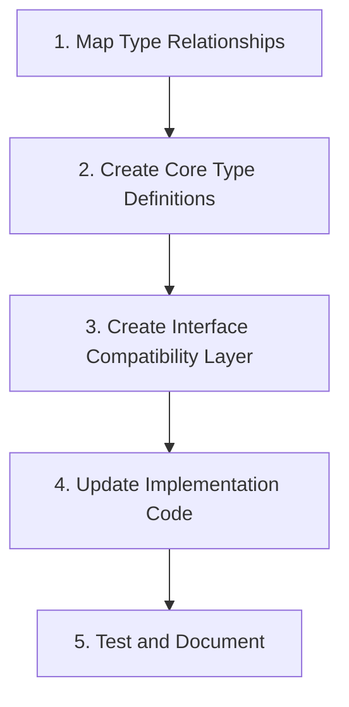

# BatchIt Type System Consolidation Plan

This document outlines the implementation plan for Phase 3 of the BatchIt refactoring: Type System Consolidation. Building on the comprehensive analysis in `docs/type-system-analysis.md`, this plan provides a step-by-step approach to simplify and standardize the type system while maintaining backward compatibility.

## Objectives

1. Reduce type duplication and inconsistency
2. Create a clear type hierarchy with proper relationships
3. Standardize naming conventions
4. Maintain backward compatibility
5. Improve type safety and developer experience

## Implementation Strategy

The implementation will follow a incremental approach with well-defined phases to minimize disruption:



## Detailed Implementation Plan

### 1. Map Type Relationships (2 days)

Build on the existing analysis by creating a comprehensive mapping of all type relationships and usage patterns.

**Tasks:**
- Document all import/export relationships between type files
- Identify type usage patterns across the codebase
- Create detailed dependency graph for types
- Identify high-impact types used in multiple places

**Deliverable:** Type relationship map document with dependency graph

### 2. Create Core Type Definitions (3 days)

Define the standardized type system with clear hierarchies and relationships.

**Tasks:**

#### 2.1. Define Path Types
```typescript
// src/types/filesystem/paths.ts
export interface PathOptions {
  rootDirectory: string;
  excludedDirs?: string[];
  allowRelative?: boolean;
}

export interface PathValidationResult {
  normalizedPath: string;
  isDirectory: boolean;
  isWithinRoot: boolean;
}
```

#### 2.2. Define Operation Types
```typescript
// src/types/filesystem/operations.ts
export interface BaseOperation {
  path: string;
  options?: Record<string, unknown>;
}

export interface ReadOperation extends BaseOperation {
  operation: 'read';
  encoding?: BufferEncoding;
  startLine?: number;
  endLine?: number;
}

export interface WriteOperation extends BaseOperation {
  operation: 'write';
  content: unknown;
  tracking?: ContentTrackingOptions;
  template?: string;
}

export interface UpdateOperation extends BaseOperation {
  operation: 'update';
  mode: 'overwrite' | 'append' | 'diff';
  content?: string;
  diff?: DiffOperation[];
  tracking?: ContentTrackingOptions;
}

export interface MoveOperation extends BaseOperation {
  operation: 'move';
  destination: string;
  overwrite?: boolean;
}

export interface CopyOperation extends BaseOperation {
  operation: 'copy';
  destination: string;
  overwrite?: boolean;
}

export interface DeleteOperation extends BaseOperation {
  operation: 'delete';
  recursive?: boolean;
}

export type FileSystemOperation =
  | ReadOperation
  | WriteOperation
  | UpdateOperation
  | MoveOperation
  | CopyOperation
  | DeleteOperation;
```

#### 2.3. Define Result Types
```typescript
// src/types/filesystem/results.ts
export interface BaseResult {
  path: string;
  success: boolean;
  error?: string;
  durationMs?: number;
}

export interface ReadResult extends BaseResult {
  operation: 'read';
  content?: string;
  binary?: boolean;
  mimeType?: string;
}

export interface WriteResult extends BaseResult {
  operation: 'write';
  content?: string;
  size?: number;
  contentTracking?: ContentModification;
}

export interface UpdateResult extends BaseResult {
  operation: 'update';
  summary?: string;
  contentTracking?: ContentModification;
}

export interface MoveResult extends BaseResult {
  operation: 'move';
  destination: string;
}

export interface CopyResult extends BaseResult {
  operation: 'copy';
  destination: string;
}

export interface DeleteResult extends BaseResult {
  operation: 'delete';
}

export type FileSystemResult =
  | ReadResult
  | WriteResult
  | UpdateResult
  | MoveResult
  | CopyResult
  | DeleteResult;
```

#### 2.4. Define File Information Types
```typescript
// src/types/filesystem/fileInfo.ts
export interface BaseFileInfo {
  path: string;
  name: string;
  exists: boolean;
}

export interface FileStats {
  size: number;
  created: string;
  modified: string;
  accessed: string;
  permissions: string;
}

export interface FileMetadata {
  mimeType?: string;
  encoding?: string;
  dimensions?: { width: number; height: number };
  duration?: number;
  pageCount?: number;
  [key: string]: unknown;
}

export interface FileInfo extends BaseFileInfo, FileStats {
  type: 'file';
  metadata?: FileMetadata;
}

export interface DirectoryInfo extends BaseFileInfo, FileStats {
  type: 'directory';
  children?: Array<FileInfo | DirectoryInfo>;
}

export interface SymlinkInfo extends BaseFileInfo, FileStats {
  type: 'symlink';
  target: string;
}

export type FSEntryInfo = FileInfo | DirectoryInfo | SymlinkInfo;
```

#### 2.5. Define Content Tracking Types
```typescript
// src/types/filesystem/contentTracking.ts
export interface ContentTrackingOptions {
  enabled: boolean;
  trackSize?: boolean;
  trackType?: boolean;
  trackDiff?: boolean;
  diffContextLines?: number;
}

export interface ContentModification {
  path: string;
  timestamp: string;
  operation: 'create' | 'update' | 'delete';
  size?: number;
  type?: string;
  diff?: string;
}
```

#### 2.6. Define Batch Operation Types
```typescript
// src/types/batch/operations.ts
export interface BatchOperationBase {
  id?: string;
  tool: string;
  dependsOn?: string | string[];
}

export interface BatchOperationWithArgs extends BatchOperationBase {
  arguments: Record<string, unknown>;
}

export interface BatchOperationWithTemplate extends BatchOperationWithArgs {
  arguments: Record<string, unknown> & {
    template?: string;
    content?: unknown;
  };
}

export interface BatchExecutionOptions {
  maxConcurrent?: number;
  timeoutMs?: number;
  stopOnError?: boolean;
  keepAlive?: boolean;
}

export interface BatchOperationResult {
  id?: string;
  tool: string;
  success: boolean;
  result?: unknown;
  error?: string;
  errorCode?: number;
  durationMs?: number;
}
```

**Deliverable:** New type definition files with clear hierarchies

### 3. Create Interface Compatibility Layer (2 days)

Ensure backward compatibility by creating adapter interfaces that map between old and new types.

**Tasks:**
- Create type adapters for key interfaces
- Add deprecation notices to old interfaces
- Document migration path for consumers
- Ensure type safety with proper typing

Example compatibility layer:

```typescript
// src/types/compat/operations.ts
import {
  FileSystemOperation,
  ReadOperation,
  WriteOperation
} from '../filesystem/operations';
import {
  TemplateArguments,
  Operation as LegacyOperation
} from '../operations';

/**
 * @deprecated Use FileSystemOperation from types/filesystem/operations instead
 */
export function adaptLegacyOperation(op: LegacyOperation): FileSystemOperation {
  // Conversion logic
}

/**
 * @deprecated Use types from filesystem/operations instead
 */
export function createLegacyOperation(op: FileSystemOperation): LegacyOperation {
  // Conversion logic
}
```

**Deliverable:** Compatibility layer with type adapters

### 4. Update Implementation Code (4-5 days)

Incrementally update the implementation code to use the new type system while maintaining compatibility.

**Tasks:**
- Identify high-priority files for migration
- Update imports to use new type definitions
- Use type adapters where needed for compatibility
- Add deprecation notices in code comments
- Update JSDoc comments to reflect new types

**Priority files for migration:**
1. `src/filesystem/FileSystem.ts`
2. `src/filesystem/pathValidation.ts`
3. `src/filesystem/contentTracking.ts`
4. `src/utils/resultResolver.ts`
5. `src/providers/factory.ts`

**Deliverable:** Updated implementation files using new type system

### 5. Test and Document (3 days)

Verify the changes work correctly and update documentation.

**Tasks:**
- Run existing tests to ensure functionality
- Add tests for new type relationships
- Update documentation with new type system
- Provide migration examples for consumers
- Create type usage guide with examples

**Deliverable:** Updated tests and documentation reflecting the new type system

## Technical Approach for Backward Compatibility

To ensure backward compatibility while improving the type system, we'll use a multi-layered approach:

1. **Type Aliasing**: For simple cases, use `export type OldType = NewType` to maintain compatibility

2. **Interface Extension**: For complex types, extend or implement the new interfaces
   ```typescript
   export interface NewInterface { /* new properties */ }
   /** @deprecated Use NewInterface instead */
   export interface OldInterface extends NewInterface { /* old specific properties */ }
   ```

3. **Union Types**: Use union types to support both old and new formats
   ```typescript
   export type CompatibleType = NewType | OldType;
   ```

4. **Type Guards**: Create type guards to differentiate between old and new types
   ```typescript
   export function isNewType(value: CompatibleType): value is NewType {
     // Type checking logic
   }
   ```

5. **Adapter Functions**: Create adapter functions to convert between old and new types
   ```typescript
   export function adaptToNewType(old: OldType): NewType {
     // Conversion logic
   }
   ```

## Implementation Timeline

| Task | Duration | Target Completion |
|------|----------|-------------------|
| Map Type Relationships | 2 days | March 28, 2025 |
| Create Core Type Definitions | 3 days | March 31, 2025 |
| Create Interface Compatibility Layer | 2 days | April 2, 2025 |
| Update Implementation Code | 4-5 days | April 7, 2025 |
| Test and Document | 3 days | April 10, 2025 |

## Metrics for Success

1. **Reduction in Type Count**: Measure the decrease in total types used throughout the codebase
2. **Type Reuse**: Measure how many modules reuse the same core types
3. **Test Pass Rate**: Ensure all tests continue to pass
4. **Documentation Coverage**: Ensure all new types are properly documented
5. **Developer Experience**: Evaluate ease of use with the new type system

## Next Steps

1. Create a detailed type relationship map
2. Implement the core type definitions
3. Develop the compatibility layer
4. Update key implementation files
5. Test and document the changes
