# BatchIt Type System Guide

This guide provides comprehensive documentation for the new type system in BatchIt, including examples, migration guidance, best practices, and information about backward compatibility.

## Table of Contents

1. [Introduction](#introduction)
2. [Core Type Hierarchy](#core-type-hierarchy)
3. [Using the New Type System](#using-the-new-type-system)
   - [Path Types](#path-types)
   - [Operation Types](#operation-types)
   - [Result Types](#result-types)
   - [File Information Types](#file-information-types)
   - [Content Tracking Types](#content-tracking-types)
4. [Migration from Old to New Types](#migration-from-old-to-new-types)
   - [Operation Migration](#operation-migration)
   - [Result Migration](#result-migration)
   - [Content Tracking Migration](#content-tracking-migration)
5. [Best Practices](#best-practices)
   - [Type Discrimination](#type-discrimination)
   - [Error Handling](#error-handling)
   - [Type Safety](#type-safety)
6. [Direct Usage](#direct-usage)
   - [Type Guards](#type-guards)
   - [Error Handling](#error-handling)
   - [Best Practices](#best-practices)
7. [Advanced Usage](#advanced-usage)
   - [Type Guards](#type-guards)
   - [Generic Operations](#generic-operations)
   - [Custom Extensions](#custom-extensions)

## Introduction

The BatchIt type system has been redesigned to provide a more consistent, type-safe, and maintainable foundation for filesystem operations. The new type system organizes types into clear hierarchies with proper relationships, standardizes naming conventions, and provides better type safety.

Key improvements in the new type system:

- **Clear Type Hierarchies**: Types are organized into logical hierarchies with proper extension relationships
- **Discriminated Unions**: Operations and results use discriminated unions for better type safety
- **Standardized Naming**: Consistent naming conventions across all types
- **Reduced Duplication**: Elimination of duplicate and overlapping types
- **Better Documentation**: Comprehensive JSDoc comments for all types

## Core Type Hierarchy

The new type system is organized into five main categories:

1. **Path Types**: Types related to path validation and normalization
2. **Operation Types**: Types representing filesystem operations
3. **Result Types**: Types representing operation results
4. **File Information Types**: Types for file and directory information
5. **Content Tracking Types**: Types for tracking content changes

```mermaid
graph TD
    %% Path Types
    PathOptions[PathOptions]
    PathValidationResult[PathValidationResult]

    %% Operation Types
    BaseOperation[BaseOperation]
    ReadOperation[ReadOperation]
    WriteOperation[WriteOperation]
    UpdateOperation[UpdateOperation]
    MoveOperation[MoveOperation]
    CopyOperation[CopyOperation]
    DeleteOperation[DeleteOperation]
    FileSystemOperation[FileSystemOperation]

    %% Result Types
    BaseResult[BaseResult]
    ReadResult[ReadResult]
    WriteResult[WriteResult]
    UpdateResult[UpdateResult]
    MoveResult[MoveResult]
    CopyResult[CopyResult]
    DeleteResult[DeleteResult]
    FileSystemResult[FileSystemResult]

    %% File Information Types
    BaseFileInfo[BaseFileInfo]
    FileStats[FileStats]
    FileMetadata[FileMetadata]
    FileInfo[FileInfo]
    DirectoryInfo[DirectoryInfo]
    SymlinkInfo[SymlinkInfo]
    FSEntryInfo[FSEntryInfo]

    %% Content Tracking Types
    ContentTrackingOptions[ContentTrackingOptions]
    ContentModification[ContentModification]

    %% Relationships
    BaseOperation --> ReadOperation
    BaseOperation --> WriteOperation
    BaseOperation --> UpdateOperation
    BaseOperation --> MoveOperation
    BaseOperation --> CopyOperation
    BaseOperation --> DeleteOperation

    FileSystemOperation --> ReadOperation
    FileSystemOperation --> WriteOperation
    FileSystemOperation --> UpdateOperation
    FileSystemOperation --> MoveOperation
    FileSystemOperation --> CopyOperation
    FileSystemOperation --> DeleteOperation

    BaseResult --> ReadResult
    BaseResult --> WriteResult
    BaseResult --> UpdateResult
    BaseResult --> MoveResult
    BaseResult --> CopyResult
    BaseResult --> DeleteResult

    FileSystemResult --> ReadResult
    FileSystemResult --> WriteResult
    FileSystemResult --> UpdateResult
    FileSystemResult --> MoveResult
    FileSystemResult --> CopyResult
    FileSystemResult --> DeleteResult

    BaseFileInfo --> FileInfo
    BaseFileInfo --> DirectoryInfo
    BaseFileInfo --> SymlinkInfo

    FSEntryInfo --> FileInfo
    FSEntryInfo --> DirectoryInfo
    FSEntryInfo --> SymlinkInfo
```



## Using the New Type System

### Path Types

The path types provide a consistent way to validate and normalize file paths.

```typescript
import { PathOptions, PathValidationResult } from '../types/filesystem/paths.js';

// Create path validation options
const pathOptions: PathOptions = {
  rootDirectory: '/root',
  excludedDirs: ['/root/node_modules'],
  allowRelative: false
};

// Example path validation function
function validatePath(path: string, options: PathOptions): PathValidationResult {
  // Implementation...
  return {
    normalizedPath: '/root/file.txt',
    isDirectory: false,
    isWithinRoot: true
  };
}
```

### Operation Types

Operation types represent different filesystem operations with a clear discriminated union pattern.

```typescript
import {
  ReadOperation,
  WriteOperation,
  UpdateOperation,
  FileSystemOperation
} from '../types/filesystem/operations.js';

// Create a read operation
const readOp: ReadOperation = {
  operation: 'read',
  path: '/root/file.txt',
  encoding: 'utf8',
  startLine: 1,
  endLine: 10
};

// Create a write operation
const writeOp: WriteOperation = {
  operation: 'write',
  path: '/root/file.txt',
  content: 'Hello, world!',
  tracking: {
    enabled: true,
    trackDiff: true
  }
};

// Create an update operation with diff mode
const updateOp: UpdateOperation = {
  operation: 'update',
  path: '/root/file.txt',
  mode: 'diff',
  diff: [
    {
      line: 5,
      operation: 'replace',
      text: 'New text'
    }
  ]
};

// Using the union type
function executeOperation(op: FileSystemOperation): Promise<unknown> {
  switch (op.operation) {
    case 'read':
      return readFile(op.path, op.encoding);
    case 'write':
      return writeFile(op.path, op.content);
    case 'update':
      if (op.mode === 'diff') {
        return applyDiff(op.path, op.diff);
      } else {
        return updateContent(op.path, op.mode, op.content);
      }
    // Handle other operations...
  }
}
```

### Result Types

Result types represent the outcomes of filesystem operations.

```typescript
import {
  ReadResult,
  WriteResult,
  FileSystemResult
} from '../types/filesystem/results.js';

// Create a read result
const readResult: ReadResult = {
  operation: 'read',
  path: '/root/file.txt',
  success: true,
  content: 'Hello, world!',
  binary: false,
  mimeType: 'text/plain'
};

// Create a write result
const writeResult: WriteResult = {
  operation: 'write',
  path: '/root/file.txt',
  success: true,
  content: 'Hello, world!',
  size: 13,
  contentTracking: {
    path: '/root/file.txt',
    timestamp: new Date().toISOString(),
    operation: 'create',
    size: 13,
    type: 'text/plain'
  }
};

// Process any result type
function processResult(result: FileSystemResult): void {
  if (!result.success) {
    console.error(`Operation failed: ${result.error}`);
    return;
  }

  switch (result.operation) {
    case 'read':
      console.log(`Read content: ${result.content}`);
      break;
    case 'write':
      console.log(`Wrote ${result.size} bytes`);
      break;
    // Handle other result types...
  }
}
```

### File Information Types

File information types provide detailed information about files, directories, and symbolic links.

```typescript
import {
  FileInfo,
  DirectoryInfo,
  FSEntryInfo
} from '../types/filesystem/fileInfo.js';

// Create file information
const fileInfo: FileInfo = {
  path: '/root/file.txt',
  name: 'file.txt',
  exists: true,
  type: 'file',
  size: 13,
  created: new Date().toISOString(),
  modified: new Date().toISOString(),
  accessed: new Date().toISOString(),
  permissions: 'rw-r--r--',
  metadata: {
    mimeType: 'text/plain',
    encoding: 'utf8'
  }
};

// Create directory information
const dirInfo: DirectoryInfo = {
  path: '/root/dir',
  name: 'dir',
  exists: true,
  type: 'directory',
  size: 4096,
  created: new Date().toISOString(),
  modified: new Date().toISOString(),
  accessed: new Date().toISOString(),
  permissions: 'rwxr-xr-x',
  children: [fileInfo]
};

// Process any filesystem entry
function processEntry(entry: FSEntryInfo): void {
  console.log(`Path: ${entry.path}`);
  console.log(`Type: ${entry.type}`);

  if (entry.type === 'file') {
    console.log(`Size: ${entry.size} bytes`);
    console.log(`MIME Type: ${entry.metadata?.mimeType}`);
  } else if (entry.type === 'directory') {
    console.log(`Children: ${entry.children?.length || 0}`);
  } else if (entry.type === 'symlink') {
    console.log(`Target: ${entry.target}`);
  }
}
```

### Content Tracking Types

Content tracking types provide a way to track changes to file content.

```typescript
import {
  ContentTrackingOptions,
  ContentModification
} from '../types/filesystem/contentTracking.js';

// Create content tracking options
const trackingOptions: ContentTrackingOptions = {
  enabled: true,
  trackSize: true,
  trackType: true,
  trackDiff: true,
  diffContextLines: 3
};

// Create a content modification record
const modification: ContentModification = {
  path: '/root/file.txt',
  timestamp: new Date().toISOString(),
  operation: 'update',
  size: 13,
  type: 'text/plain',
  diff: '--- old\n+++ new\n@@ -1,1 +1,1 @@\n-Old line\n+New line'
};

// Process a content modification
function processModification(mod: ContentModification): void {
  console.log(`File ${mod.path} was ${mod.operation}d at ${mod.timestamp}`);

  if (mod.size) {
    console.log(`New size: ${mod.size} bytes`);
  }

  if (mod.diff) {
    console.log(`Changes:\n${mod.diff}`);
  }
}
```

## Migration from Old to New Types

### Operation Migration

The old operation types were based on a generic `Operation` interface with tool-specific arguments. The new system uses a discriminated union of specific operation types.

**Old Style:**

```typescript
import { Operation } from '../types/operations.js';

// Old write operation
const oldWriteOp: Operation = {
  id: 'write1',
  tool: 'write_file',
  arguments: {
    path: '/root/file.txt',
    content: 'Hello, world!',
    contentTracking: {
      enabled: true,
      trackDiff: true
    }
  }
};

// Old update operation
const oldUpdateOp: Operation = {
  id: 'update1',
  tool: 'update_file',
  arguments: {
    path: '/root/file.txt',
    operation: {
      mode: 'append',
      content: 'Additional content'
    }
  }
};
```

**New Style:**

```typescript
import { WriteOperation, UpdateOperation } from '../types/filesystem/operations.js';

// New write operation
const newWriteOp: WriteOperation = {
  operation: 'write',
  path: '/root/file.txt',
  content: 'Hello, world!',
  tracking: {
    enabled: true,
    trackDiff: true
  }
};

// New update operation
const newUpdateOp: UpdateOperation = {
  operation: 'update',
  path: '/root/file.txt',
  mode: 'append',
  content: 'Additional content'
};
```

**Migration Helper:**

```typescript
import { Operation } from '../types/operations.js';
import { FileSystemOperation, WriteOperation, UpdateOperation } from '../types/filesystem/operations.js';

// Convert old Operation to new FileSystemOperation
function convertToNewOperation(oldOp: Operation): FileSystemOperation | null {
  if (oldOp.tool === 'write_file' && oldOp.arguments?.path) {
    return {
      operation: 'write',
      path: oldOp.arguments.path as string,
      content: oldOp.arguments.content,
      tracking: oldOp.arguments.contentTracking
    } as WriteOperation;
  }

  if (oldOp.tool === 'update_file' && oldOp.arguments?.path) {
    const opArgs = oldOp.arguments.operation as any;

    if (opArgs?.mode === 'diff') {
      return {
        operation: 'update',
        path: oldOp.arguments.path as string,
        mode: 'diff',
        diff: opArgs.operations
      } as UpdateOperation;
    } else {
      return {
        operation: 'update',
        path: oldOp.arguments.path as string,
        mode: opArgs?.mode,
        content: opArgs?.content
      } as UpdateOperation;
    }
  }

  // Handle other operation types...
  return null;
}
```

### Result Migration

Similar to operations, result types have been migrated from a generic `OperationResult` to specific result types.

**Old Style:**

```typescript
import { OperationResult } from '../types/operations.js';

// Old read result
const oldReadResult: OperationResult = {
  id: 'read1',
  tool: 'read_file',
  success: true,
  result: {
    content: 'Hello, world!',
    path: '/root/file.txt',
    binary: false
  }
};
```

**New Style:**

```typescript
import { ReadResult } from '../types/filesystem/results.js';

// New read result
const newReadResult: ReadResult = {
  operation: 'read',
  path: '/root/file.txt',
  success: true,
  content: 'Hello, world!',
  binary: false
};
```

**Migration Helper:**

```typescript
import { OperationResult } from '../types/operations.js';
import { FileSystemResult, ReadResult, WriteResult } from '../types/filesystem/results.js';

// Convert old OperationResult to new FileSystemResult
function convertToNewResult(oldResult: OperationResult): FileSystemResult | null {
  if (oldResult.tool === 'read_file') {
    const resultData = oldResult.result as any;

    return {
      operation: 'read',
      path: resultData?.path,
      success: oldResult.success,
      content: resultData?.content,
      binary: resultData?.binary,
      mimeType: resultData?.mimeType,
      durationMs: oldResult.durationMs
    } as ReadResult;
  }

  if (oldResult.tool === 'write_file') {
    const resultData = oldResult.result as any;

    return {
      operation: 'write',
      path: resultData?.path,
      success: oldResult.success,
      content: resultData?.content,
      size: resultData?.size,
      contentTracking: resultData?.contentModification,
      durationMs: oldResult.durationMs
    } as WriteResult;
  }

  // Handle other result types...
  return null;
}
```

### Content Tracking Migration

Content tracking types have been standardized but maintain similar structure.

**Old Style:**

```typescript
import { ContentTrackingOptions, ContentModification } from '../types/operations.js';

// Old content tracking options
const oldOptions: ContentTrackingOptions = {
  enabled: true,
  trackSize: true,
  trackType: true,
  trackDiff: true,
  diffContextLines: 3
};

// Old content modification
const oldMod: ContentModification = {
  path: '/root/file.txt',
  timestamp: new Date().toISOString(),
  operation: 'update',
  size: 13,
  type: 'text/plain',
  diff: '--- old\n+++ new\n@@ -1,1 +1,1 @@\n-Old line\n+New line'
};
```

**New Style:**

```typescript
import { ContentTrackingOptions, ContentModification } from '../types/filesystem/contentTracking.js';

// New content tracking options
const newOptions: ContentTrackingOptions = {
  enabled: true,
  trackSize: true,
  trackType: true,
  trackDiff: true,
  diffContextLines: 3
};

// New content modification
const newMod: ContentModification = {
  path: '/root/file.txt',
  timestamp: new Date().toISOString(),
  operation: 'update',
  size: 13,
  type: 'text/plain',
  diff: '--- old\n+++ new\n@@ -1,1 +1,1 @@\n-Old line\n+New line'
};
```

## Best Practices

### Type Discrimination

Use the discriminated union pattern to safely work with different operation and result types:

```typescript
import { FileSystemOperation, ReadOperation, WriteOperation } from '../types/filesystem/operations.js';

function processOperation(op: FileSystemOperation): void {
  // Type-safe discrimination
  switch (op.operation) {
    case 'read':
      // TypeScript knows op is ReadOperation here
      console.log(`Reading from ${op.path} with encoding ${op.encoding || 'utf8'}`);
      break;
    case 'write':
      // TypeScript knows op is WriteOperation here
      console.log(`Writing to ${op.path}: ${typeof op.content === 'string' ? op.content.substring(0, 20) : '[non-string content]'}`);
      break;
    // Handle other cases...
  }
}

// Alternative using type guards
function isReadOperation(op: FileSystemOperation): op is ReadOperation {
  return op.operation === 'read';
}

function isWriteOperation(op: FileSystemOperation): op is WriteOperation {
  return op.operation === 'write';
}

function processOperationWithGuards(op: FileSystemOperation): void {
  if (isReadOperation(op)) {
    // TypeScript knows op is ReadOperation here
    console.log(`Reading from ${op.path} with encoding ${op.encoding || 'utf8'}`);
  } else if (isWriteOperation(op)) {
    // TypeScript knows op is WriteOperation here
    console.log(`Writing to ${op.path}: ${typeof op.content === 'string' ? op.content.substring(0, 20) : '[non-string content]'}`);
  }
  // Handle other cases...
}
```

### Error Handling

Handle errors consistently using the result types:

```typescript
import { FileSystemResult } from '../types/filesystem/results.js';

function handleResult(result: FileSystemResult): void {
  if (!result.success) {
    console.error(`Operation ${result.operation} failed for ${result.path}: ${result.error}`);
    return;
  }

  console.log(`Operation ${result.operation} succeeded for ${result.path}`);

  // Process specific result types...
}
```

### Type Safety

Leverage TypeScript's type system to ensure type safety:

```typescript
import { WriteOperation, UpdateOperation } from '../types/filesystem/operations.js';

// Use specific types for parameters
function writeFile(options: Omit<WriteOperation, 'operation'>): Promise<void> {
  const op: WriteOperation = {
    operation: 'write',
    ...options
  };

  // Implementation...
  return Promise.resolve();
}

// Use specific types for return values
function getUpdateOperation(path: string, content: string): UpdateOperation {
  return {
    operation: 'update',
    path,
    mode: 'overwrite',
    content
  };
}
```

## Direct Usage

The BatchIt type system has been fully migrated to use the new consolidated types directly. The compatibility layer and deprecated types have been removed, ensuring a more consistent and type-safe codebase.

### Type Guards

Type guards are essential for working with the discriminated union types in the new type system:

```typescript
import { FileSystemOperation, ReadOperation, WriteOperation, UpdateOperation } from '../types/filesystem/operations.js';

// Type guards for operation types
export function isReadOperation(op: FileSystemOperation): op is ReadOperation {
  return op.operation === 'read';
}

export function isWriteOperation(op: FileSystemOperation): op is WriteOperation {
  return op.operation === 'write';
}

export function isUpdateOperation(op: FileSystemOperation): op is UpdateOperation {
  return op.operation === 'update';
}

// Type guard for diff mode update operations
export function isDiffUpdateOperation(op: FileSystemOperation): op is UpdateOperation & { mode: 'diff'; diff: any[] } {
  return isUpdateOperation(op) && op.mode === 'diff' && Array.isArray(op.diff);
}
```

### Error Handling

Proper error handling with the new type system:

```typescript
import { FileSystemResult } from '../types/filesystem/results.js';

function handleResult(result: FileSystemResult): void {
  if (!result.success) {
    console.error(`Operation ${result.operation} failed for ${result.path}: ${result.error}`);
    return;
  }

  console.log(`Operation ${result.operation} succeeded for ${result.path}`);

  // Process specific result types using type discrimination
  switch (result.operation) {
    case 'read':
      console.log(`Content: ${result.content}`);
      break;
    case 'write':
      console.log(`Size: ${result.size} bytes`);
      break;
    // Handle other result types...
  }
}
```

### Best Practices

1. **Always use the new type system directly** - Import types from the filesystem-specific modules
2. **Leverage discriminated unions** - Use the operation property for type discrimination
3. **Create type guards** - For complex type checking scenarios
4. **Use specific operation types** - Rather than the union type when the operation is known
5. **Handle all cases** - When working with union types, handle all possible cases

## Advanced Usage

## Advanced Usage

### Type Guards

Type guards enable more complex type discrimination:

```typescript
import { FileSystemOperation, ReadOperation, WriteOperation, UpdateOperation } from '../types/filesystem/operations.js';

// Type guards for operation types
export function isReadOperation(op: FileSystemOperation): op is ReadOperation {
  return op.operation === 'read';
}

export function isWriteOperation(op: FileSystemOperation): op is WriteOperation {
  return op.operation === 'write';
}

export function isUpdateOperation(op: FileSystemOperation): op is UpdateOperation {
  return op.operation === 'update';
}

// Type guard for diff mode update operations
export function isDiffUpdateOperation(op: FileSystemOperation): op is UpdateOperation & { mode: 'diff'; diff: any[] } {
  return isUpdateOperation(op) && op.mode === 'diff' && Array.isArray(op.diff);
}
```

### Generic Operations

Use generics for more flexible operation handling:

```typescript
import { FileSystemOperation, FileSystemResult } from '../types/filesystem/index.js';

// Generic operation executor
async function executeOperation<T extends FileSystemOperation>(
  operation: T
): Promise<Extract<FileSystemResult, { operation: T['operation'] }>> {
  // Implementation...
  // This ensures the result type matches the operation type
}

// Usage
const readOp = { operation: 'read', path: '/file.txt' } as const;
const result = await executeOperation(readOp);
// result is typed as ReadResult
```

### Custom Extensions

Extend the type system for custom needs:

```typescript
import { FileSystemOperation, ReadOperation } from '../types/filesystem/operations.js';

// Custom operation type
interface GrepOperation extends ReadOperation {
  operation: 'grep';
  pattern: string;
  caseSensitive?: boolean;
}

// Add to union type
type ExtendedFileSystemOperation = FileSystemOperation | GrepOperation;

// Custom result type
interface GrepResult extends ReadResult {
  operation: 'grep';
  matches: Array<{
    line: number;
    content: string;
  }>;
}

// Add to union type
type ExtendedFileSystemResult = FileSystemResult | GrepResult;
